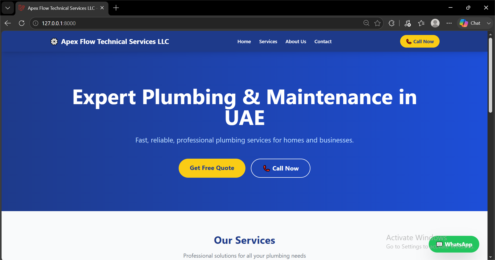
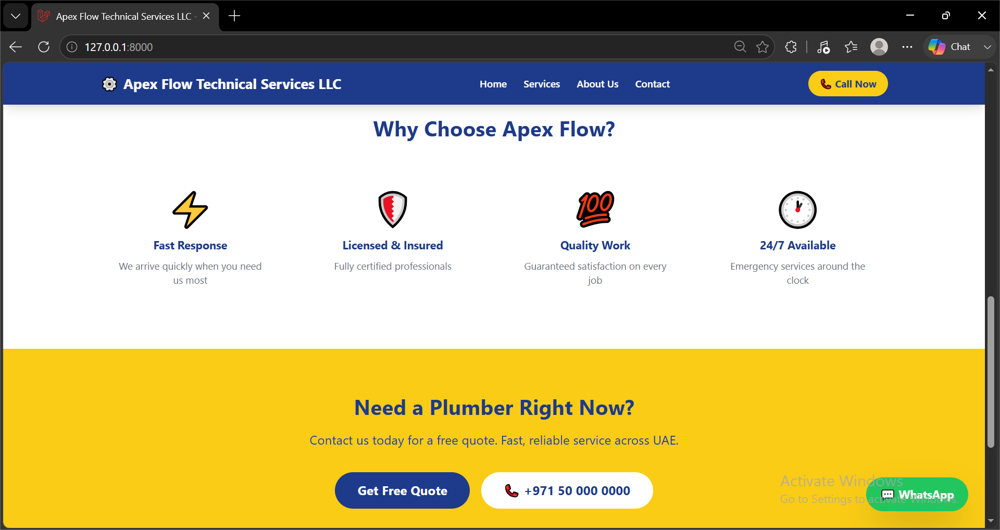
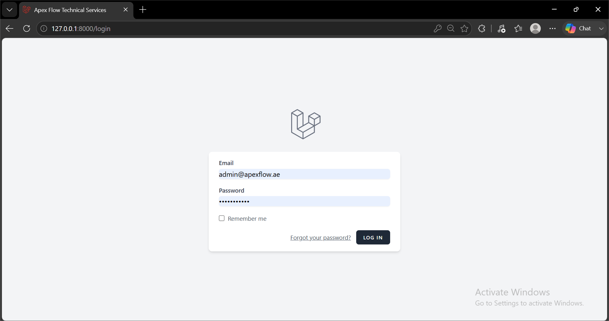
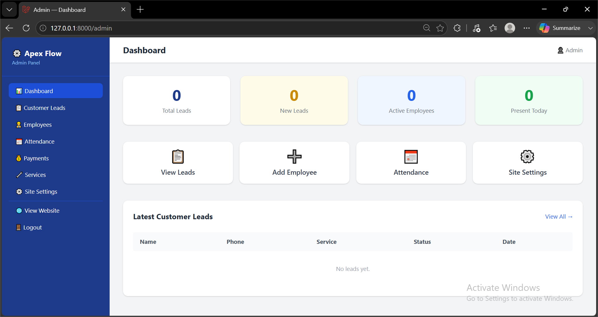
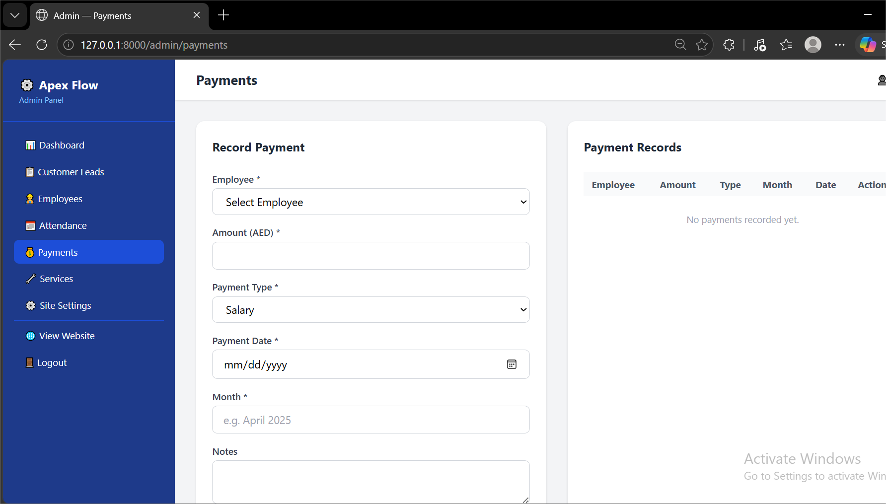
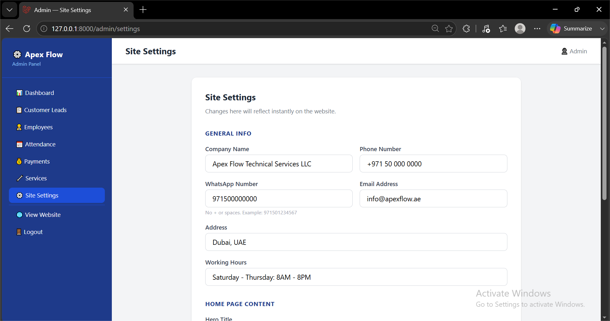

# Apex Flow Technical Services LLC

**Plumbing Website & Workforce Management System**

`Laravel` `PHP` `MySQL` `TailwindCSS`

A fully functional plumbing company website with a complete admin dashboard and workforce management system, built with Laravel 11 and MySQL.

Built as a freelance project for a real plumbing services business — covers both the public-facing marketing website and an internal admin system for managing leads, employees, attendance, and payments.

## Screenshots

**Public Website**




**Admin Panel**







## 🌐 Website Features

- Modern, clean, responsive UI built with Tailwind CSS
- Home page with hero section, services, and CTA
- Services page dynamically loaded from the database
- About Us page
- Contact page with lead capture form
- ☎️ Click-to-Call button on every page
- 💬 WhatsApp floating button on every page
- Fully mobile responsive

## 🔐 Admin Panel Features

- Secure login system
- **Site Settings** — edit all website content without touching code
- **Customer Leads** — view and manage contact form submissions
- **Services** — add, edit, delete services shown on the website
- **Employees** — full CRUD for employee records
- **Attendance** — mark daily attendance per employee
- **Payments** — record salary, bonus, and advance payments

## ⚙️ Tech Stack

| Technology | Version |
|---|---|
| PHP | 8.2 |
| Laravel | 11 |
| MySQL | Latest |
| Tailwind CSS | 3 |
| Node.js | 20+ |

## 🚀 Installation

```bash
# Clone the repository
git clone https://github.com/AreebaGhaffar/apexflow.git

# Install PHP dependencies
composer install

# Install and build frontend assets
npm install
npm run build

# Copy environment file
cp .env.example .env

# Update .env with your database credentials
# Then run:
php artisan key:generate
php artisan migrate
php artisan db:seed --class=SiteSettingsSeeder

# Start the server
php artisan serve
```

## 📸 Pages

| Page | Description |
|---|---|
| `/` | Home page |
| `/services` | All services |
| `/about` | About us |
| `/contact` | Contact form |
| `/login` | Admin login |
| `/admin` | Admin dashboard |

## 📁 Project Structure

```
apexflow/
├── app/
│   └── Http/
│       └── Controllers/
│           ├── WebsiteController.php    # Public website pages
│           └── Admin/                   # All admin controllers
├── resources/
│   └── views/
│       ├── layouts/                     # Shared layouts
│       ├── website/                     # Public pages
│       └── admin/                       # Admin pages
├── database/
│   └── migrations/                      # All database tables
└── routes/
    └── web.php                          # All routes
```

## 👤 Author

Built by **Areeba Ghaffar**
GitHub: [@AreebaGhaffar](https://github.com/AreebaGhaffar)